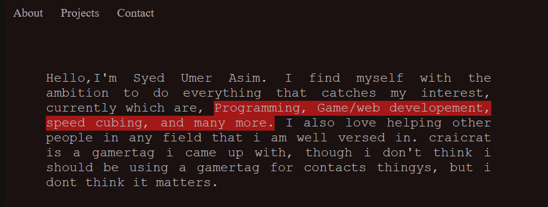
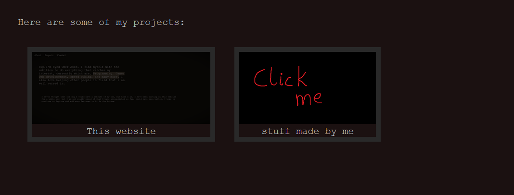
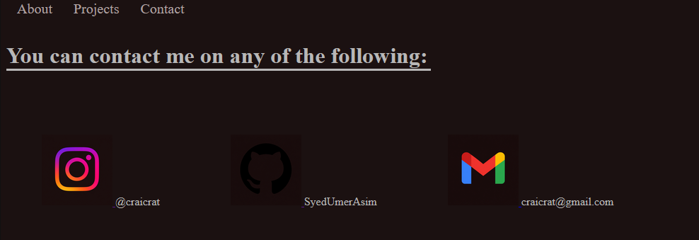

My first personal website, also first project on html+css aswell as first experience of VS code AND github.
I made this project for hackclubs summer challenge "Stardance"
its not much but honest work
It has a small paragraph about information about myself in the About tab,

Projects tab features all my projects, though there are not really any projects, so itll stay empty until i make updates, just a fun video in the "stuff made by me" box

Contacts is where you can find places to reach out to me(they are some of them, not all of them)

there is a almost hidden page, see if you can find it.

Had to do it while preparing for my exams so it took longer than expected.
In the making of this, "HTML and CSS Full course" by a youtube channel named "Bro Code" helped alot.
 (10/10 will recommend checking out).
 Special thanks to my friend Muhammad Aayan Mirza for telling me about Stardance, otherwise i might have never learnt, experienced, and done any of this.
